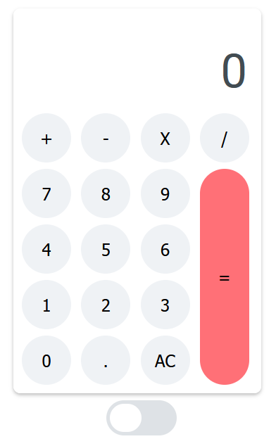

## CALCULADORA

> Olá, estou desenvolvendo esse projeto para me ajudar a entender como
> funciona o JavaScript junto com o HTML e CSS.
> Um projeto bem simpels de uma calculadora.

### NIGHT MODE E SUN MODE

> Adicionado um botão para você escolher em qual tema deseja fazer as suas operaçãoes.
> Logo abaixo da calculadora, há um botão onde permite a mudança de temas

### BOTÕES FUNCIONAIS

> Cada botão atende o seu devido requisito, os númericos adicionam números.
> Os operadores, adicionam o seus correspondentes.
> O cálculo é feito automáticamente depois que você coloca o número, o operador e o próximo número, > sem precisar clicar em "="
